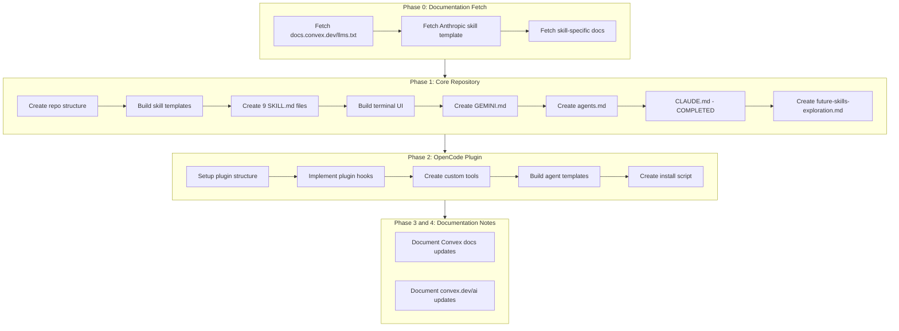

# Convex Skills Repository and AI Integration Plan

## CRITICAL: Documentation First

**Before building any new files, ALWAYS fetch the current documentation and links before implementing. Do not assume. Fetch updated documentation and links for each skill.**

Required documentation sources to fetch before implementation:

- https://docs.convex.dev/llms.txt (primary reference)
- Skill-specific documentation URLs listed in section 1.3
- https://github.com/anthropics/skills/blob/main/template/SKILL.md (template format)
- https://github.com/getsentry/skills (repository structure reference)

---

## Project Overview

Build a production-ready Convex Skills GitHub repository modeled after [getsentry/skills](https://github.com/getsentry/skills), containing AI-consumable skill documentation for Convex development. The project includes a terminal UI for skill browsing, integration files for Claude/Gemini, and an OpenCode plugin for Convex sync.

---

## Phase 1: Repository Structure and Core Skills

### 1.1 Repository Structure

```
convex-skills/
├── README.md
├── LICENSE
├── CONTRIBUTING.md
├── CLAUDE.md                    # Default Convex CLAUDE.md template
├── GEMINI.md                    # Gemini CLI integration file
├── agents.md                    # Convex agents specification
├── files.md                     # Project file documentation
├── changelog.md                 # Project changelog
├── skills/
│   ├── convex-best-practices/
│   │   └── SKILL.md
│   ├── convex-component-authoring/
│   │   └── SKILL.md
│   ├── convex-realtime/
│   │   └── SKILL.md
│   ├── convex-functions/
│   │   └── SKILL.md
│   ├── convex-file-storage/
│   │   └── SKILL.md
│   ├── convex-security-check/
│   │   └── SKILL.md
│   ├── convex-security-audit/
│   │   └── SKILL.md
│   ├── convex-schema-validator/
│   │   └── SKILL.md
│   └── convex-agents/
│       └── SKILL.md
├── src/
│   └── terminal-ui/             # Terminal UI for skill browsing
│       ├── index.html
│       ├── styles.css
│       └── app.ts
├── prds/
│   ├── create-convex-opencode-integration.md
│   └── future-skills-exploration.md
└── opencode-plugin/             # Phase 2: OpenCode integration
    └── ...
```

### 1.2 Skill Template Format (Anthropic-Approved)

**IMPORTANT**: Before creating each skill, fetch the latest documentation from the URLs listed in section 1.3. Do not assume content is current.

Each SKILL.md follows this exact structure:

```markdown
---
name: Skill Name
description: Brief description of what this skill does
version: 1.0.0
author: Convex
tags: [convex, database, realtime]
---

# Skill Name

Brief overview paragraph explaining the skill purpose.

## Documentation Sources

Before implementing, do not assume; fetch the latest documentation:

- Primary: [specific-doc-url]
- For broader context: https://docs.convex.dev/llms.txt

## Instructions

[Detailed instructions for the AI assistant]

## Examples

[Code examples with proper Convex patterns]

## Best Practices

- Never run `npx convex deploy` unless explicitly instructed
- Never run any git commands unless explicitly instructed
- [Skill-specific practices]

## References

- Convex Documentation: https://docs.convex.dev/
- Convex LLMs.txt: https://docs.convex.dev/llms.txt
- Source: [Original documentation URL]
```

### 1.3 Skills to Create

| Skill | Folder Name | Primary Documentation |

| -------------------------- | ---------------------------- | ---------------------------------------------------------------------------------------------------------------------------------------- |

| Convex Best Practices | `convex-best-practices` | https://docs.convex.dev/understanding/best-practices/, https://docs.convex.dev/error#1, https://docs.convex.dev/functions/error-handling |

| Convex Component Authoring | `convex-component-authoring` | https://docs.convex.dev/components/authoring |

| Convex Realtime | `convex-realtime` | https://docs.convex.dev/realtime |

| Convex Functions | `convex-functions` | https://docs.convex.dev/functions |

| Convex File Storage | `convex-file-storage` | https://docs.convex.dev/file-storage |

| Convex Security Check | `convex-security-check` | https://docs.convex.dev/auth, https://docs.convex.dev/production |

| Convex Security Audit | `convex-security-audit` | https://docs.convex.dev/auth/functions-auth |

| Convex Schema Validator | `convex-schema-validator` | https://docs.convex.dev/database/schemas |

| Convex Agents | `convex-agents` | https://docs.convex.dev/agents |

### 1.4 Terminal UI Page

A static HTML/CSS/TypeScript terminal-style interface that:

- Lists all skills in tree format with `ls --tree` aesthetic
- Click to open SKILL.md in new window
- Dark terminal with gradient background (orange/coral to teal/blue)
- Amber/gold text color scheme (NOT green)
- MD badge icons next to each markdown file
- Yellow folder icon for skills directory
- Tree branch characters for file hierarchy

**Design Reference**: Matches the provided image with gradient background and tree structure

```
┌──────────────────────────────────────────────────────────────────┐
│ ~/projects/convex-skills/ (main)                                 │
│                                                                  │
│ ▲  convex-skills/ (main) ls --tree skills                       │
│ 📁 skills                                                        │
│ ├── 🔖 convex-best-practices.md                                  │
│ ├── 🔖 convex-component-authoring.md                             │
│ ├── 🔖 convex-realtime.md                                        │
│ ├── 🔖 convex-functions.md                                       │
│ ├── 🔖 convex-file-storage.md                                    │
│ ├── 🔖 convex-security-check.md                                  │
│ ├── 🔖 convex-security-audit.md                                  │
│ ├── 🔖 convex-schema-validator.md                                │
│ └── 🔖 convex-agents.md                                          │
│ ▲  convex-skills/ (main) █                                       │
└──────────────────────────────────────────────────────────────────┘
```

**Color Palette**:

- Background: Gradient from `#ff6b4a` (coral) to `#2d8f8f` (teal)
- Folder name: `#f5a623` (amber/gold)
- File names: `#d4a84b` (warm amber)
- MD badges: Amber background with dark text
- Branch lines: `#888` (muted gray)
- Terminal prompt: `#f5a623` (amber)

---

## Phase 1B: Supporting Documentation Files

### 1B.1 GEMINI.md Creation

Based on https://geminicli.com/docs/cli/gemini-md/, create a Convex-specific GEMINI.md:

```markdown
# Convex Development Context

## Project Type

Convex real-time backend application

## Key Technologies

- Convex (serverless database & functions)
- TypeScript
- React (frontend)

## Convex-Specific Guidelines

[Guidelines for Gemini CLI when working with Convex projects]

## Schema Reference

[Placeholder for auto-generated schema info]

## Available Functions

[Placeholder for function signatures]
```

### 1B.2 agents.md Creation

Based on https://agents.md format:

```markdown
# Convex Agents

## Overview

AI agents built on Convex for persistent, stateful workflows.

## Capabilities

- Thread management
- Tool integration
- Streaming responses
- RAG patterns
- Workflow orchestration

## Integration

[Details on integrating Convex agents]
```

### 1B.3 CLAUDE.md Template (COMPLETED)

**Status**: Already completed in a previous session.

The default CLAUDE.md template for Convex projects has been created.

**Team Recommendation**: Since Convex has schema introspection, implement `npx convex claude-init` command that generates CLAUDE.md with:

- Actual table names from schema
- Function signatures from convex/ directory
- Configured components
- Environment variable placeholders

**Note**: This task is marked as completed and does not need to be rebuilt.

---

## Phase 1C: Future Skills Exploration

Create `prds/future-skills-exploration.md` documenting potential skills:

1. **Convex Search** - Full-text and vector search patterns
2. **Convex Cron Jobs** - Scheduled function patterns
3. **Convex HTTP Actions** - External API integration
4. **Convex Pagination** - Cursor-based pagination
5. **Convex Migrations** - Schema migration strategies
6. **Convex Testing** - Unit and integration testing
7. **Convex Rate Limiting** - Rate limiting patterns
8. **Convex Multi-tenancy** - Multi-tenant architecture
9. **Convex Webhooks** - Webhook handling patterns
10. **Convex Streaming** - Real-time streaming patterns

---

## Phase 2: OpenCode Plugin

Reference: [prds/create-convex-opencode-integration.md](prds/create-convex-opencode-integration.md)

```
opencode-plugin/
├── package.json
├── README.md
├── plugin/
│   ├── index.ts              # Main plugin export
│   ├── sync.ts               # File sync and dev server management
│   ├── context.ts            # Deployment context injection
│   └── tools.ts              # Custom Convex tools for agents
├── template/
│   ├── opencode.json         # OpenCode config with Convex defaults
│   ├── agents/
│   │   ├── convex-build.md   # Primary agent for Convex development
│   │   └── convex-debug.md   # Subagent for debugging
│   └── commands/
│       ├── convex-init.md
│       ├── convex-deploy.md
│       └── convex-logs.md
└── install.ts                # Installation script
```

Key plugin hooks:

- `session.start`: Run convex dev status, inject deployment context
- `file.edited`: Trigger schema push on convex/ changes
- `tool.execute.before`: Add schema context, block \_generated/ edits
- `tool.execute.after`: Remind to test with MCP tools
- `session.idle`: Check for dev server errors

Custom tools:

- `convex_schema_suggest`: Analyze and improve schema
- `convex_function_test`: Run functions with test args
- `convex_migration_plan`: Generate migration strategies

---

## Phase 3: Convex Documentation Updates (Note Only)

**Location**: https://github.com/get-convex/convex-backend/tree/main/npm-packages/docs/docs

**Proposed additions to docs/ai/**:

- skills.md - Link to convex-skills repo
- claude.md - CLAUDE.md generation guide
- gemini.md - GEMINI.md template
- opencode.md - OpenCode plugin documentation

**No action required** - Document for Convex team consideration.

---

## Phase 4: convex.dev/ai Updates (Note Only)

**Location**: https://github.com/get-convex/convex-backend/tree/main/npm-packages/docs/docs/ai

**Proposed updates**:

- Add skills directory listing
- Link to convex-skills GitHub repo
- Add "AI Tools" section featuring Claude, Gemini, OpenCode integrations

**No action required** - Document for Convex team consideration.

---

## Project Tracking Files

### files.md

Track all project files with descriptions:

```markdown
# Convex Skills Project Files

## Root Files

- `README.md` - Project overview and installation
- `CLAUDE.md` - Default Claude template for Convex
- `GEMINI.md` - Gemini CLI integration
- `agents.md` - Convex agents specification
  ...
```

### changelog.md

Follow https://keepachangelog.com/en/1.0.0/:

```markdown
# Changelog

## [Unreleased]

### Added

- Initial repository structure
- 9 core Convex skills
- Terminal UI for skill browsing
  ...
```

---

## Implementation Order



**Note**: Phase 0 (Documentation Fetch) must be completed before creating any skills. Each skill requires fresh documentation retrieval.

---

## Publication Checklist

Before publishing to Claude Code Marketplace:

- [ ] All 9 skills complete and validated
- [ ] Terminal UI functional (amber/gold tree design)
- [ ] GEMINI.md tested with Gemini CLI
- [ ] agents.md follows specification
- [x] CLAUDE.md template validated (COMPLETED)
- [ ] OpenCode plugin tested
- [ ] README matches getsentry/skills quality
- [ ] License file added (MIT recommended)
- [ ] CONTRIBUTING.md with guidelines
- [ ] All documentation links verified (fetch before implementation)
- [ ] files.md and changelog.md current

---

## Key References

- Anthropic Skills Template: https://github.com/anthropics/skills/blob/main/template/SKILL.md
- Sentry Skills Repo: https://github.com/getsentry/skills
- Convex LLMs.txt: https://docs.convex.dev/llms.txt
- Convex Documentation: https://docs.convex.dev/
- Claude Skills Guide: https://support.claude.com/en/articles/12512198-how-to-create-custom-skills
- Gemini CLI: https://geminicli.com/docs/cli/gemini-md/
- OpenCode Plugins: https://opencode.ai/docs/plugins/
