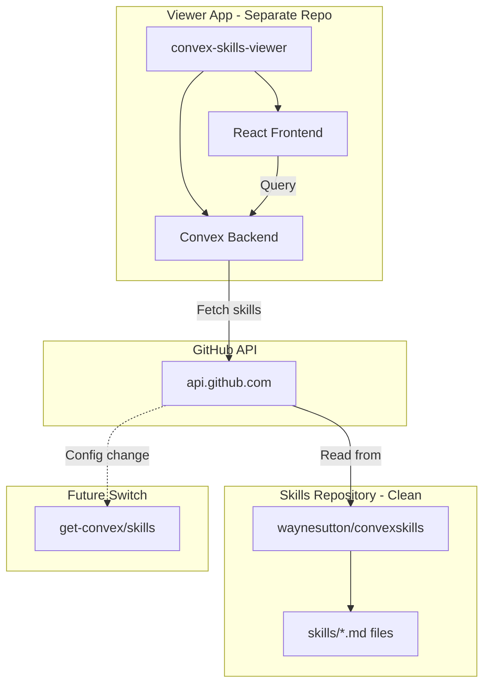

# Convex Skills Viewer App

## Architecture Overview



## Two Repositories

| Repository | Purpose | Contents |

| -------------------------- | ---------------------- | --------------------------------- |

| `waynesutton/convexskills` | Publish to Claude Code | Skills only, CLAUDE.md, AGENTS.md |

| `convex-skills-viewer` | Web app to browse | Convex backend, React terminal UI |

---

## Phase 1: Clean Up convexskills Repo

Remove `src/` directory from convexskills (you'll copy locally first):

**Final structure:**

```
convexskills/
├── skills/
│   ├── convex-best-practices/SKILL.md
│   ├── convex-functions/SKILL.md
│   └── ... (9 skills)
├── CLAUDE.md
├── AGENTS.md
├── GEMINI.md
├── agents.md
├── README.md
├── LICENSE
└── CONTRIBUTING.md
```

Remove: `src/`, `opencode-plugin/`, `prds/`, `task.md`, `files.md`, `changelog.md`

---

## Phase 2: Create convex-skills-viewer App

### 2.1 Project Setup

```bash
mkdir convex-skills-viewer
cd convex-skills-viewer
npm create convex@latest
```

Select: React + Vite + TypeScript

### 2.2 Directory Structure

```
convex-skills-viewer/
├── convex/
│   ├── schema.ts           # Skills table
│   ├── skills.ts           # Queries for skills
│   ├── sync.ts             # GitHub sync action
│   └── crons.ts            # Scheduled sync
├── src/
│   ├── components/
│   │   ├── Terminal.tsx    # Terminal container
│   │   ├── SkillTree.tsx   # Skills list
│   │   ├── SkillView.tsx   # Markdown viewer
│   │   └── SearchOverlay.tsx
│   ├── App.tsx
│   ├── main.tsx
│   └── index.css           # Terminal styles
├── .env.local              # SKILLS_REPO config
└── package.json
```

---

## Phase 3: Convex Backend

### 3.1 Schema

```typescript
// convex/schema.ts
import { defineSchema, defineTable } from "convex/server";
import { v } from "convex/values";

export default defineSchema({
  skills: defineTable({
    skillId: v.string(), // e.g., "convex-best-practices"
    name: v.string(), // From YAML frontmatter
    description: v.string(), // From YAML frontmatter
    content: v.string(), // Full markdown content
    tags: v.array(v.string()), // From YAML frontmatter
    version: v.string(),
    lastSynced: v.number(),
  })
    .index("by_skillId", ["skillId"])
    .searchIndex("search_skills", {
      searchField: "content",
      filterFields: ["skillId"],
    }),

  syncStatus: defineTable({
    repo: v.string(),
    lastSync: v.number(),
    skillCount: v.number(),
    status: v.union(v.literal("success"), v.literal("error")),
    error: v.optional(v.string()),
  }).index("by_repo", ["repo"]),
});
```

### 3.2 GitHub Sync Action

```typescript
// convex/sync.ts
"use node";

import { action, internalMutation } from "./_generated/server";
import { v } from "convex/values";
import { internal } from "./_generated/api";

// Configurable repo source
const SKILLS_REPO = process.env.SKILLS_REPO || "waynesutton/convexskills";

export const syncFromGitHub = action({
  args: {},
  returns: v.object({ synced: v.number() }),
  handler: async (ctx) => {
    // Fetch skills directory from GitHub API
    const response = await fetch(
      `https://api.github.com/repos/${SKILLS_REPO}/contents/skills`,
      {
        headers: { Accept: "application/vnd.github.v3+json" },
      },
    );

    const directories = await response.json();
    let synced = 0;

    for (const dir of directories) {
      if (dir.type !== "dir" || dir.name === "template") continue;

      // Fetch SKILL.md content
      const skillResponse = await fetch(
        `https://raw.githubusercontent.com/${SKILLS_REPO}/main/skills/${dir.name}/SKILL.md`,
      );
      const content = await skillResponse.text();

      // Parse YAML frontmatter
      const metadata = parseYamlFrontmatter(content);

      // Upsert skill in Convex
      await ctx.runMutation(internal.sync.upsertSkill, {
        skillId: dir.name,
        name: metadata.name || dir.name,
        description: metadata.description || "",
        content,
        tags: metadata.tags || [],
        version: metadata.version || "1.0.0",
      });

      synced++;
    }

    return { synced };
  },
});
```

### 3.3 Skills Queries

```typescript
// convex/skills.ts
import { query } from "./_generated/server";
import { v } from "convex/values";

export const list = query({
  args: {},
  returns: v.array(
    v.object({
      _id: v.id("skills"),
      skillId: v.string(),
      name: v.string(),
      description: v.string(),
      tags: v.array(v.string()),
    }),
  ),
  handler: async (ctx) => {
    return await ctx.db.query("skills").collect();
  },
});

export const get = query({
  args: { skillId: v.string() },
  returns: v.union(
    v.object({
      _id: v.id("skills"),
      skillId: v.string(),
      name: v.string(),
      description: v.string(),
      content: v.string(),
      tags: v.array(v.string()),
    }),
    v.null(),
  ),
  handler: async (ctx, args) => {
    return await ctx.db
      .query("skills")
      .withIndex("by_skillId", (q) => q.eq("skillId", args.skillId))
      .unique();
  },
});

export const search = query({
  args: { query: v.string() },
  returns: v.array(
    v.object({
      _id: v.id("skills"),
      skillId: v.string(),
      name: v.string(),
      description: v.string(),
    }),
  ),
  handler: async (ctx, args) => {
    return await ctx.db
      .query("skills")
      .withSearchIndex("search_skills", (q) => q.search("content", args.query))
      .take(10);
  },
});
```

---

## Phase 4: React Frontend

### 4.1 Terminal Component (from existing styles)

Convert the existing HTML/CSS/JS to React components:

- `Terminal.tsx` - Main container with header/footer
- `SkillTree.tsx` - List of skills with keyboard navigation
- `SkillView.tsx` - Markdown renderer for skill content
- `SearchOverlay.tsx` - Search modal

### 4.2 Routing

```typescript
// src/App.tsx
import { BrowserRouter, Routes, Route } from "react-router-dom";

function App() {
  return (
    <BrowserRouter>
      <Routes>
        <Route path="/" element={<Terminal />} />
        <Route path="/skills/:skillId" element={<SkillView />} />
      </Routes>
    </BrowserRouter>
  );
}
```

### 4.3 Real-time Updates

Skills list updates automatically when sync runs:

```typescript
// src/components/SkillTree.tsx
import { useQuery } from "convex/react";
import { api } from "../../convex/_generated/api";

function SkillTree() {
  const skills = useQuery(api.skills.list);

  if (skills === undefined) return <div>Loading...</div>;

  return (
    <div className="tree-container">
      {skills.map((skill, index) => (
        <SkillItem key={skill._id} skill={skill} index={index} />
      ))}
    </div>
  );
}
```

---

## Phase 5: Configuration for Repo Switching

### Environment Variable

```bash
# .env.local (current)
SKILLS_REPO=waynesutton/convexskills

# .env.local (after transfer)
SKILLS_REPO=get-convex/skills
```

### Convex Environment Variable

Set in Convex dashboard or via CLI:

```bash
npx convex env set SKILLS_REPO get-convex/skills
```

Then trigger a re-sync to pull from new repo.

---

## Implementation Order

1. Copy `src/terminal-ui/` to new location locally
2. Remove `src/` from convexskills repo
3. Create `convex-skills-viewer` directory
4. Run `npm create convex@latest`
5. Create schema and sync action
6. Convert HTML/CSS to React components
7. Add routing for skill pages
8. Set up scheduled sync (cron every hour)
9. Deploy to Convex

---

## Key Files to Create

| File | Purpose |

| ------------------------------ | ------------------------------ |

| `convex/schema.ts` | Skills table with search index |

| `convex/skills.ts` | List, get, search queries |

| `convex/sync.ts` | GitHub fetch action |

| `convex/crons.ts` | Hourly sync schedule |

| `src/components/Terminal.tsx` | Main terminal UI |

| `src/components/SkillTree.tsx` | Skills list with navigation |

| `src/components/SkillView.tsx` | Markdown viewer |

| `.env.local` | SKILLS_REPO configuration |
